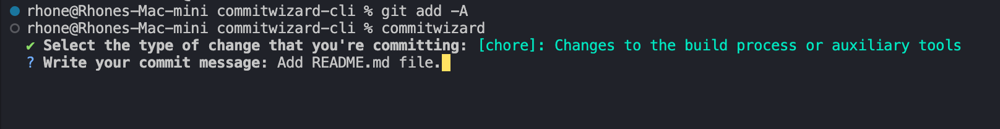
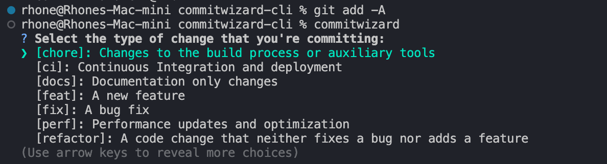

# CommitWizard CLI

**CommitWizard CLI** is a command-line tool that helps developers write consistent and structured Git commit messages by interactively selecting a commit category before writing the message. This ensures best practices are followed and makes it easier to maintain a clear commit history.

## Features

* **Interactive commit prompts**: Select a commit category from a list of predefined options.
* **Structured commit messages**: Automatically prepend the selected category to your commit message.
* **Customizable categories**: Easily modify the categories to suit your workflow.

## Installation

To install CommitWizard globally:

`npm install -g commitwizard-cli`

## Usage

After staging your changes, simply run:

`commitwizard`

Follow the prompts to select a commit category and write your commit message. CommitWizard will automatically format and create the Git commit for you.

## Commit Categories

CommitWizard provides the following categories for your commit messages:

* **chore**: Changes to the build process or auxiliary tools
* **ci**: Continuous Integration and deployment
* **docs**: Documentation only changes
* **feat**: A new feature
* **fix**: A bug fix
* **perf**: Performance updates and optimization
* **refactor**: A code change that neither fixes a bug nor adds a feature
* **remove**: Removing files or unnecessary code
* **revert**: Undo changes that have been committed to the repository
* **style**: Changes that do not affect the meaning of the code
* **test**: Adding tests or correcting existing tests
* **update**: Small updates that do not change functionality

## Example

Stage your changes:

`git add -A`

Run CommitWizard:

`commitwizard`

Select a category and write your commit message:

? Select the type of change that you're committing:

* [feat]: A new feature
* [fix]: A bug fix
* [docs]: Documentation only changes

Write your commit message: `Add feature to handle user login`

The resulting commit message will be:

`[feat]: Add feature to handle user login`

## Customization

CommitWizard allows you to define your own commit categories by creating a `.commitwizardrc` file in the root of your project. The file should be in JSON format, like so:

{
  "categories": [
    { "label": "chore", "description": "Changes to the build process or auxiliary tools" },
    { "label": "feat", "description": "A new feature" }
    // Add more categories as needed
  ]
}

## Contributing

Contributions are welcome! Feel free to open an issue or submit a pull request on [GitHub](https://github.com/RhoneLachner).

## License

MIT

## Author

Sarah Rhone Lachner ([GitHub](https://github.com/RhoneLachner))

Happy committing! 😊
